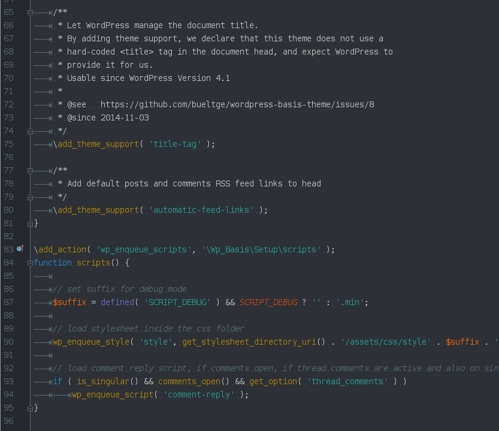

# Colorized Theme
My personal colorized theme.

### Background
I like to work with nice UIs, but on the focus to work, create a result. This Theme is a mix from a lot of colours. To work day and night on the ideas.

_Currently I have only the dark theme for the PhpStorm IDE._

 * Colorized Dark for PhpStorm IDE

### Screenshots

### Compatibility
Tested in PhpStorm 8 and 9-EAP

### Installation
#### PHPStorm
To install it, find your [configuration directory](http://www.jetbrains.com/phpstorm/webhelp/project-and-ide-settings.html) and then put it in the `/config/colors/` subfolder. Copy the `.icls` file to this folder.

 * Linux `~/.WebIdeXX/config/colors/`
 * Mac OS `~/Library/Preferences/WebIdeXXconfig/colors/`
 * Windows `c:\Users\My_User_Name\.WebIdeXX\config\colors\`

### Other Notes
Oh also, I'm German. My English might be gruesome here and there. I  making spelling mistakes, like COLOR or COLOUR. With or without the U - the result is important for me. ;)