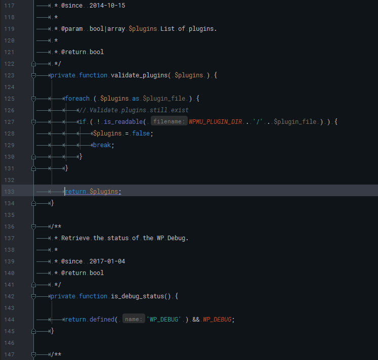

# Colorized Theme
My personal colorized theme.

### Background
I like to work with nice UIs, but on the focus to work, create a result. This Theme is a mix from a lot of colours. To work day and night on the ideas.

_Currently I have only the dark theme for the PhpStorm IDE._

* Colorized Dark for PhpStorm IDE

### Font

Colorized uses [Roboto Mono](https://fonts.google.com/specimen/Roboto+Mono) since Version 2.0.0 as main font and it's highly recommend to install it. But you can use your favorite font and the install of Roboto Mono is not necessary.

### Screenshots

#### Version 3.0.0

### Compatibility
In usage since PhpStorm 8 and currently tested, active in PhpStorm 2016.2.

### Download

* [Version 1.0.0](https://github.com/bueltge/colorized-theme/releases/tag/1.0.0)
* Version 2.* is currently the master branch and under maintenance. So you can clone this repository or use the link to [download the current master](https://github.com/bueltge/colorized-theme/archive/master.zip).

### Installation

#### PhpStorm
To install it, find your [configuration directory](http://www.jetbrains.com/phpstorm/webhelp/project-and-ide-settings.html) and then put it in the `/config/colors/` subfolder. Copy the `.icls` file to this folder.

* Linux `~/.WebIdeXX/config/colors/`
* Mac OS `~/Library/Preferences/WebIdeXXconfig/colors/`
* Windows `c:\Users\My_User_Name\.WebIdeXX\config\colors\`

Now start, restart PhpStorm and switch to the Colorized Dark theme. You find it on _File_ - _Settings_ - _Editor_ - _Colors & Fonts_ . Set also your favorite font here, sub-item _Font_.

### License

This code is licensed under the [MIT License](./LICENSE).

### Other Notes

Oh also, I'm German. My English might be gruesome here and there. I  making spelling mistakes, like COLOR or COLOUR. With or without the U - the result is important for me. ;)